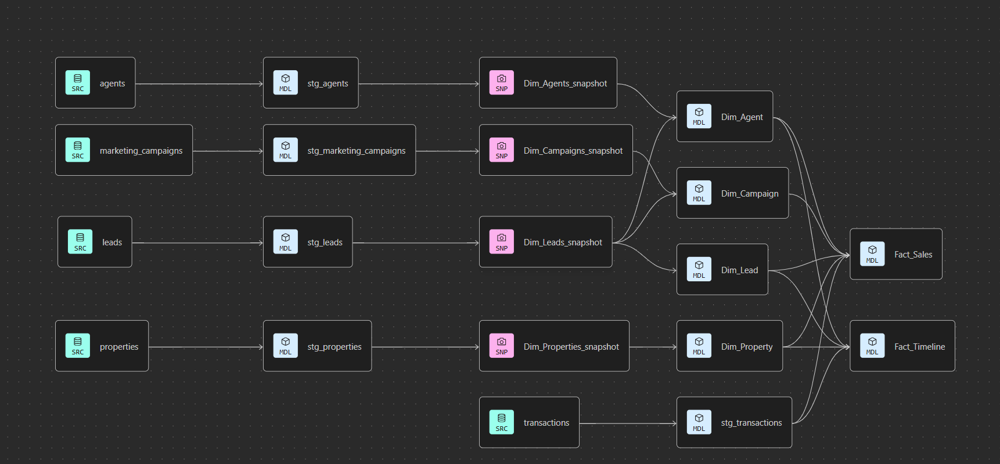
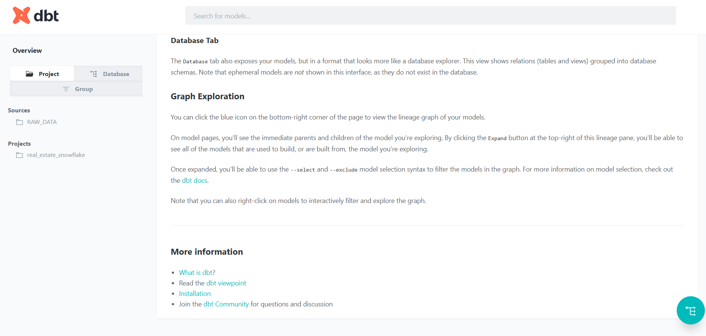
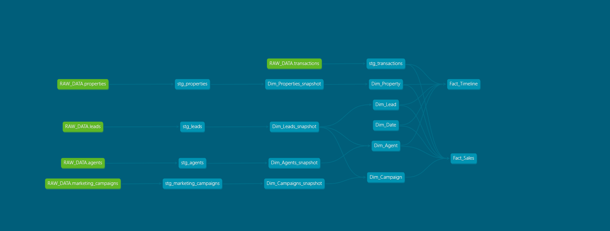

## End-to-End Data Pipeline AWS S3 to Snowflake to Tableau

#### load csv data files into AWS S3 Bucket and use dbt tool to transform and load data into snowflake cloud data warehouse.

#### Real Estate Sales and Leads Analytics Data Warehouse

This project unlocks the power of advanced analytics and reporting by transforming an OLTP architecture into an efficient OLAP system. It Leverages the capabilities of DBT and Snowflake to implement dimensional modelling and drive data-driven decision-making.

## Project Objectives

Developing a comprehensive Real Estate Sales and Leads Analytics Platform for a property company.
The system aims to centralize and analyze sales, leads, agent performance, and property listings to improve business decisions, optimize marketing efforts, and increase conversion rates.

## Aim

Design and implement a dimensional data model to store data related to:

- Properties and listings

- Customers and leads

- Sales and agent performance

- Marketing and campaign data

Enable tracking of lead-to-sale conversion, agent performance, and property trends.

## Identifying required tables from ERD

## Design Steps
- We used Inmon model (put all the information in one place (Data Warehouse)) for building Galaxy Schema.

- Galaxy Schema: type of modelss that contains many Fact tables.

in this project we have 2 fct tables
- FACT_SALES: Transaction type with grain set at a single transaction (the low level).
- FACT_TIMELINE: Accumulative fact table that stores the full procees per one sale.  

#### Build the Conceptual Data Model (Business-Level Model):

### Entities:

- Customer

- Lead

- Property

- Agent

- Marketing Campaign

- Sale Transaction

### Relationships:

- Customer → submits → Lead

- Lead → converts into → Sale Transaction

- Property → is sold in → Sale Transaction

- Agent → manages → Sale Transaction

- Campaign → generates → Lead

#### Physical Data Model

### Load and Transform data into Snowflake using Data Build Tool (dbt) 

#### In snowflake:

- create datawarehouse Realstate_dwh
- create database Realstate_db
- create schemas 
    - raw_data schema to load the data from the csv files [datasets](./Dataset/)
    - staging schema to use it as staging layer to load the data befor transform it [staging](./models/staging)
    - snapshot schema to use it to implement slowlely changing dimension type 2 (historical) (SCD 2) [snapshots](./snapshots)
    - analtycal schema to load the transformed dimensions and fact tables [warehouse](./models/warehouse)

### Final Project

using dbt commands 
- dbt run to run the project
- dbt snapshot to take a snapshot of the project 
- dbt test to apply tests wrote in tests folder [tests](./tests)
- dbt docs generate to generate documentation 
- dbt docs serve --port 8083 to generate documentation on the dbt web page

### project lineage

 

### Final Dashboard on Tableau public

[Open Tableau Dashboard](https://public.tableau.com/shared/D4NPZYZ3D?:display_count=n&:origin=viz_share_link)

## Used Tools
- AWS S3 Bucket to store source data into cloud
- Snowflake cloud data warehouse to store the data warehouse
- dbt tool to clean and transform data into the datawarehouse
- Tableau to create dashboard and story to viisualize the data

